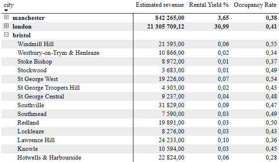
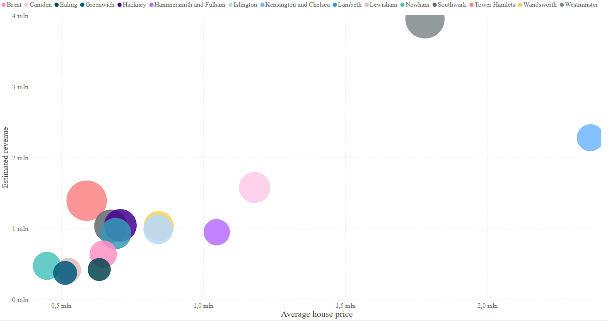

# Airbnb-market-analysis
Analysis of the Short-Term Rental Market (Airbnb) Profitability
## Project Description
The project aims to analyze the short-term rental market using the CRISP-DM methodology. The analysis includes data cleaning, examining market relationships, and building a predictive model for estimating unit occupancy rates based on their characteristics.

## Key Stages
* Data Preparation: Cleansing and integrating data from various sources (listings, calendars, property prices) using Python.

* Exploration and Visualization: Creating a Power BI dashboard integrating data from multiple cities to identify key factors influencing profitability.

* Modeling: Creating a regression model to predict unit occupancy rates based on unit attributes (amenities, location, price).

## Technologies
* Language: Python (Pandas, Scikit-learn, Seaborn, Matplotlib, SHAP)

* BI: Power BI (data modeling, Dashboard)

* Methodology: CRISP-DM

## Exploration and visualization

### 1. Profitability and Business Indicators Analysis, A summary of the **Rental Yield%** and **Occupancy Rate** indicators, broken down by district and city.

### 2. Relationship between the total property value and the estimated rental income in each area. Bubble size represents rate of return. 

## Conclusions

1. The greatest impact on utilization is due to:

2. The predictive model achieves an efficiency level of
