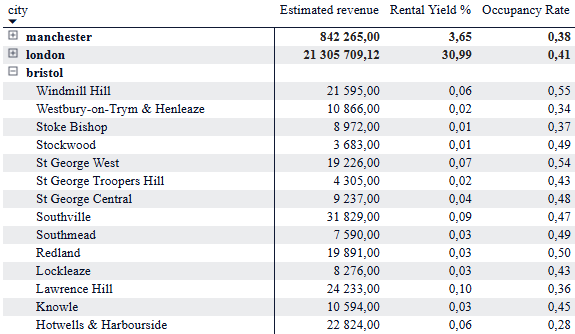
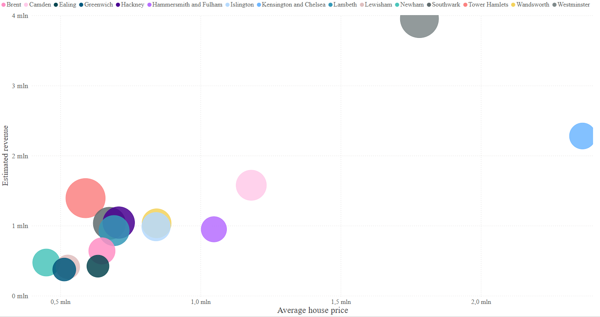

# Airbnb-market-analysis
Analysis of the Short-Term Rental Market (Airbnb) Profitability
## Project Description
The project aims to analyze the short-term rental market using the CRISP-DM methodology. The analysis includes data cleaning, examining market relationships, and building a predictive model for estimating unit occupancy rates based on their characteristics.

## Key Stages
* Data Preparation: Cleansing and integrating data from various sources (listings, calendars, property prices) using Python.

* Exploration and Visualization: Creating a Power BI dashboard integrating data from multiple cities to identify key factors influencing profitability.

* Modeling: Creating a regression model to predict unit occupancy rates based on unit attributes (amenities, location, price).

## Technologies
* Language: Python (Pandas, Scikit-learn, Seaborn, Matplotlib, SHAP)

* BI: Power BI (data modeling, Dashboard)

* Methodology: CRISP-DM

## Exploration and visualization

1. Profitability and Business Indicators Analysis, A summary of the **Rental Yield%** and **Occupancy Rate** indicators, broken down by district and city.

2. Relationship between the total property value and the estimated rental income in each area. Bubble size represents rate of return.

## Predictive Modeling & Evaluation

To predict the occupancy rate, several regression models were compared using the coefficient of determination (R²) and Mean Squared Error (MSE). Linear Regression and a single Decision Tree performed the poorest, indicating non-linear relationships in the data. Ensemble models significantly outperformed the simpler algorithms. 

| Model | R² | MSE |
| :--- | :--- | :--- |
| Linear Regression | 0.110 | 0.098 |
| Decision Tree | 0.094 | 0.100 |
| AdaBoost | 0.049 | 0.105 |
| Gradient Boosting | 0.233 | 0.084 |
| **Random Forest** | **0.282** | **0.079** |
| **XGBoost** | 0.264 | 0.081 |
| Neural Network | 0.161 | 0.093 |

## Key Conclusions (Feature Importance & SHAP Analysis)

Feature importance and SHAP analysis revealed different but complementary insights depending on the ensemble model used:

### Random Forest Insights (Geographic & Property Focus)
The Random Forest model highlighted that both the property's characteristics and its physical location drive listing interest:
* **Maximum Nights:** This is the most critical feature. The higher the maximum_nights limit, the lower the average occupancy. Properties aimed strictly at short stays achieve the highest occupancy (approx. 57%), while those allowing year-round bookings drop to 36%. Short-stay properties also generate more reviews. Longer-stay listings tend to have higher nightly prices and are often managed by professional hosts with multiple properties.
* **Price:** Higher nightly rates intuitively lower the predicted occupancy.
* **Distance to University:** Listings closer to academic campuses achieve higher occupancy, likely driven by students, staff, and visiting academics.
* **Host Listings Count:** An increase in the number of properties managed by a single host does not improve individual listing occupancy; in fact, it is often associated with slightly lower occupancy per property.
* **Host Acceptance Rate:** Hosts who accept a higher percentage of inquiries achieve higher occupancy, proving that rapid and positive responses increase booking success.

### XGBoost Insights (Host Reputation & User Experience Focus)
Unlike Random Forest, XGBoost assigned less weight to geographic coordinates and more to the guest experience:
* **Instant Bookable:** This was the second most important variable in XGBoost, indicating a strong guest preference for listings that do not require host approval waiting times.
* **Communication & Responsiveness:** High importance was placed on review_scores_communication and host_response_rate, showing that the quality of host contact heavily influences listing attractiveness.
* **Property & Room Type:** room_type and property_type ranked highly, suggesting guests care deeply about the specific nature of the accommodation, not just its price and location.

## Limitations
* **Geographical Scope:** The model is trained on specific UK cities; therefore, its findings are not universally applicable to the global Airbnb market.
* **Financial Scope:** Occupancy was estimated using calendar data, and the projected revenues do not account for property maintenance costs, taxes, or platform commission fees.
* **Uncaptured Variables:** The relatively moderate R² scores suggest that occupancy heavily depends on factors not captured in tabular data, such as listing photo quality, Airbnb search algorithm visibility, dynamic pricing strategies, or external marketing.

